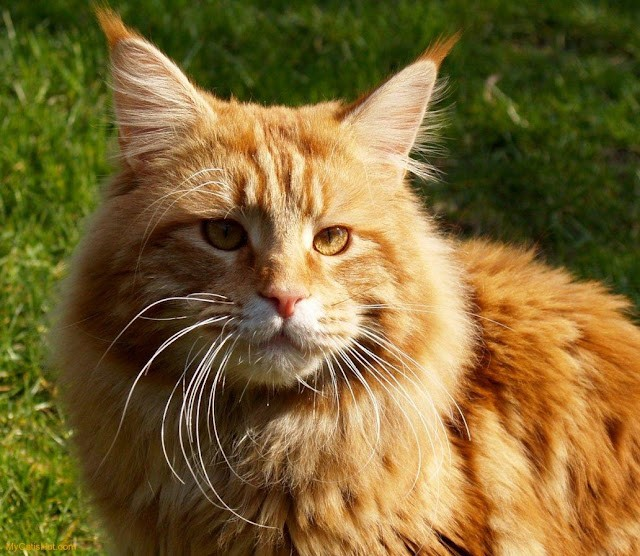
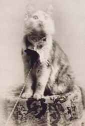

# **_Maine Coon (American Longhair)_**

>Origin - Maine, United States

The Maine Coon is a large domesticated cat breed. One of the oldest natural breeds in North America, the breed originated in the U.S. state of Maine, where it is the official state cat.

The Maine Coon is a large and social cat, which could be the reason why it has a reputation of being referred to as "_the gentle giant_." The Maine Coon is predominantly known for its size and dense coat of fur which helps it survive in the harsh climate of Maine. The Maine Coon is often cited as having "_dog-like_" characteristics.

## History ##

The Maine Coon is one of the largest domesticated cats. It has a distinctive **physical appearance** and **valuable hunting skills**. The breed was popular in cat shows in the late 19th century, but its existence became threatened when long-haired breeds from overseas were introduced in the early 20th century. The Maine Coon has since made a comeback, in 2020 becoming the third most popular pedigree cat breed in the world.

## Rise of Maine Coon ##

(_On 8 May 1895, the first North American cat show was hosted at **Madison Square Garden in New York City**. A female Maine Coon brown tabby, named Cosey, was entered into the show. Owned by Mrs. Fred Brown, Cosey won the silver collar and medal and was named Best in Show._)

The first mention of Maine Coon cats in a literary work was in 1861, in Frances Simpson's **The Book of the Cat** (1903). _F.R. Pierce_, who owned several Maine Coons, wrote a chapter about the breed. During the late 1860s, farmers located in Maine told stories about their cats and held the "Maine State Champion Coon Cat" contest at the local Skowhegan Fair. That's when the breed popularity began to rise as it was popular in shows.

With the arrival of other long-haired breeds like the Middle Eastern Persian in the early 20th century, the Maine Coon's popularity declined. No Maine Coon has won a national cat exhibition in over 40 years since 1911 in Portland, Oregon. The breed was rarely seen after that. The breed was proclaimed extinct in the 1950s due to its rapid decline, however this was regarded overdone and premature.